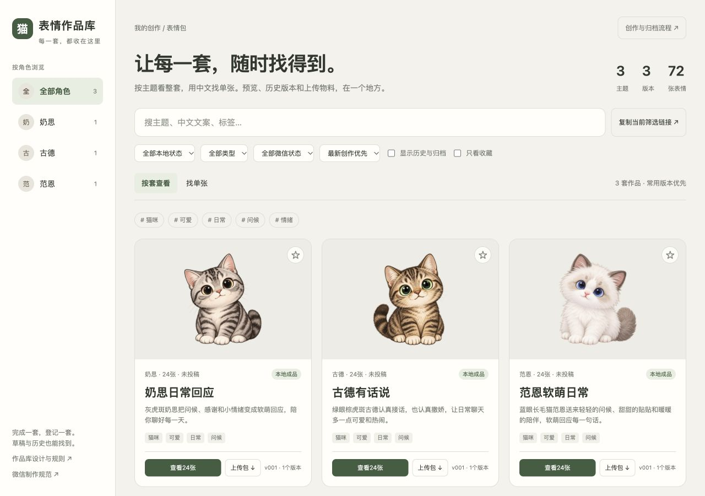
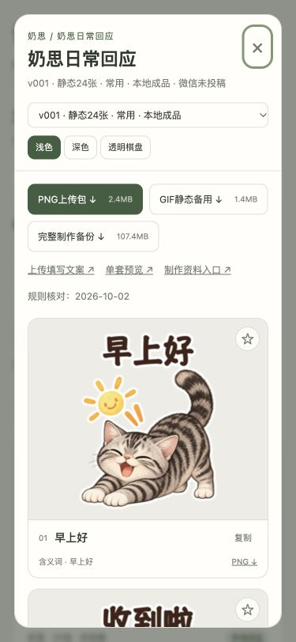

# 作品库升级交付

2026-10-02。统一入口为根目录`表情包作品库.html`，日常双击`打开作品库.command`自动刷新并打开本地网页。正式登记3套、72张：奶思日常回应、古德有话说、范恩软萌日常。原有图片、制作工程和投稿包保持原内容。

已实现按套查看、按单张中文检索、角色别名检索、组合筛选、收藏、分页、历史与归档、版本切换、三种预览底色，以及上传包、完整备份和资料下载。收藏保存在当前浏览器；系统目前为本地作品库，没有云同步或公网分享。

后续创作规则写入根目录`AGENTS.md`和`作品库设计与规则.md`。每组先登记角色、主题和递增版本，固定放置资料、原画、工程、成品、验收五个目录。草稿保留进度，完成版本必须有实际技术、视觉及ZIP验收；完成锁定后修订需新建版本，不能覆盖旧成品。唯一业务登记为`作品目录.json`，页面和README由维护工具生成。

## 验收证据

| 项目 | 结果 | 证据 |
| --- | --- | --- |
| 维护工作流隔离测试 | 15项通过 | [工作流自测.json](工作流自测.json) |
| 既有三套接入 | 3套实际完成门槛通过 | [既有成品接入验收.json](既有成品接入验收.json) |
| 成品完整性 | 748个受保护文件完整哈希及ZIP核对通过 | [作品库验收.json](../作品库验收.json) |
| 页面文件链接 | 114项通过，0缺失 | [作品库链接检查.json](../作品库链接检查.json) |
| 浏览器交互 | 23项实测记录，控制台无错误或警告 | [浏览器验收.json](浏览器验收.json) |
| 网页实际下载 | 下载ZIP与奶思版本原文件SHA256一致 | 同上download_integrity |
| 一键入口服务 | 隔离服务启动、只读返回及现有8769服务复用通过 | [一键入口服务检查.json](一键入口服务检查.json) |

手机宽度采用375px模拟视口，不代表真机测试。历史版本切换使用独立页面和合成草稿样例，未将测试作品登记到正式库。应用内浏览器不允许file协议；直接打开静态HTML未作为通过项，交付使用已验收的本地HTTP入口。启动脚本的`--open`供用户双击使用，本轮没有通过shell操作浏览器。

三套均为本地成品、微信未投稿；本次系统验收不等于微信后台审核、身份或版权资料完成。

