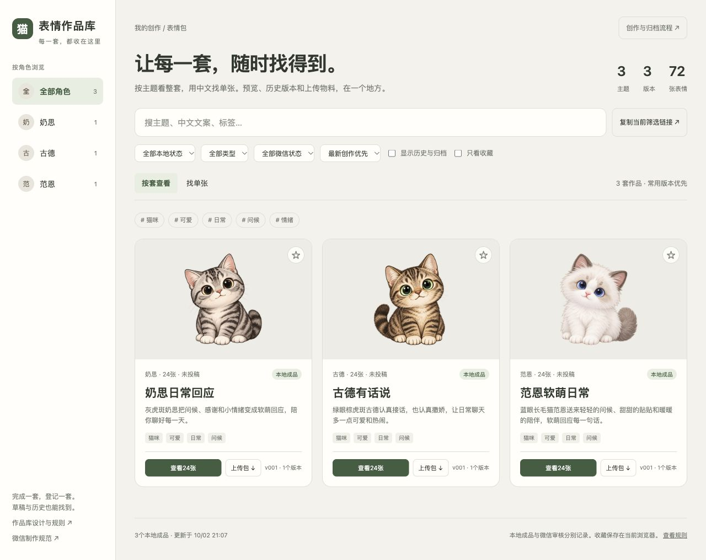

# 公开部署验收 · 2026年10月2日

[作品库](https://stickers.saymagic.cn/) 已公开上线。[GitHub仓库](https://github.com/saymagic/cat-sticker-library) 保存原画、工程、成品、登记和规则；[物料Release](https://github.com/saymagic/cat-sticker-library/releases/tag/materials-v1) 保存9份去重ZIP和路径映射。

## 已实际通过

- 奶思、古德、范恩各一套24张，共72张。21项维护与发布测试、748份锁定生产文件的哈希及ZIP内容检查通过。
- DNSPod新增 `stickers.saymagic.cn` CNAME → `saymagic.github.io`，默认线路，TTL 600；权威服务器、1.1.1.1和本机解析核对通过。
- GitHub Pages读取 `gh-pages` 根目录，独立域名的DNS检查成功，已启用Enforce HTTPS；公网请求使用正常TLS证书验证。
- 119个公开页面、图片、报告及投稿ZIP逐文件与本地发布副本比对通过。一次图片请求超时，单独重试后哈希一致；原始错误保留在记录中。
- 实际浏览器检查中文检索、角色组合、空结果、同主题版本入口、三套详情各24张加载及三种预览底色。375px手机页面无横向溢出，角色筛选和整套详情可用。
- Chrome从独立域名点击并下载奶思PNG投稿包，2,507,024字节，SHA256为 `7d166ed4ab21eba1036efb6d2bcb93209d2bb8dbc3460a41ee20baab2de64936`，与原包一致。奶思第04张PNG的实际下载也与原图一致。
- GitHub Release公开状态、10个资产的实际大小及服务端SHA256均与本地清单一致。常用6份PNG/GIF投稿包另有独立域名发布副本；完整制作备份从Release下载。

## 未标为通过的项目

GitHub Actions运行[37007562668](https://github.com/saymagic/cat-sticker-library/actions/runs/37007562668)未启动，GitHub报 `account is locked due to a billing issue`。本次使用 `bash scripts/publish_pages.sh` 在本地完成相同检查和分支发布，网站实际可访问。账号账单限制解除后，现有main工作流可自动执行同一流程；云端自动发布本次仍记为BLOCKED。

IAB等待投稿ZIP下载事件超时，改用Chrome原生浏览器完成真实下载并核对。三份大体积制作备份在Chrome中已开始下载，但当前GitHub附件网络仅约25–45KB/s，预计还需14分钟至2小时，已取消这些重复验收下载。完整备份的GitHub大小及服务端哈希已验证，端到端完整下载未标为通过。此网络限制保留在验收JSON中。

三套当前微信状态均为“未投稿”。本次公开部署不代替微信投稿、身份资料或平台审核。

## 证据与后续规则

[验收报告](验收报告.json)、[公网逐文件比对](公网文件验收.json)、[Release资产核对](Release验收.json)及下方截图记录本次验收。首次完整公网验收的源码为 `f846ea861ae628c9298f7d80d4be9048c0421e3a`；随后仅新增本验收文档和截图，再按同一流程发布及核对最终源码，避免为了改验收提交号反复产生新提交。

后续每批遵守根目录[AGENTS.md](../AGENTS.md)与[部署与更新](部署与更新.md)：先登记和创建版本，完成制作与真实验收，上传Release物料，提交源码，再发布并检查公网。保留已锁定版本，修改创建递增版本；密码、Token和平台个人凭据不得进入公开仓库。
